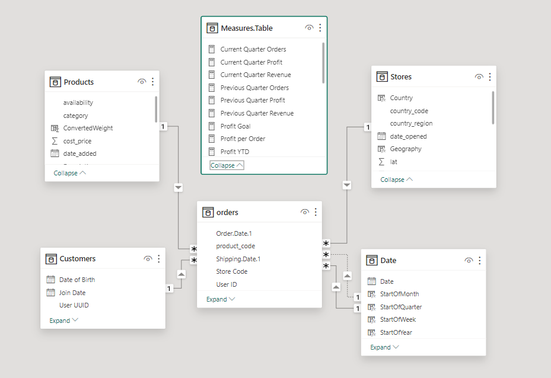
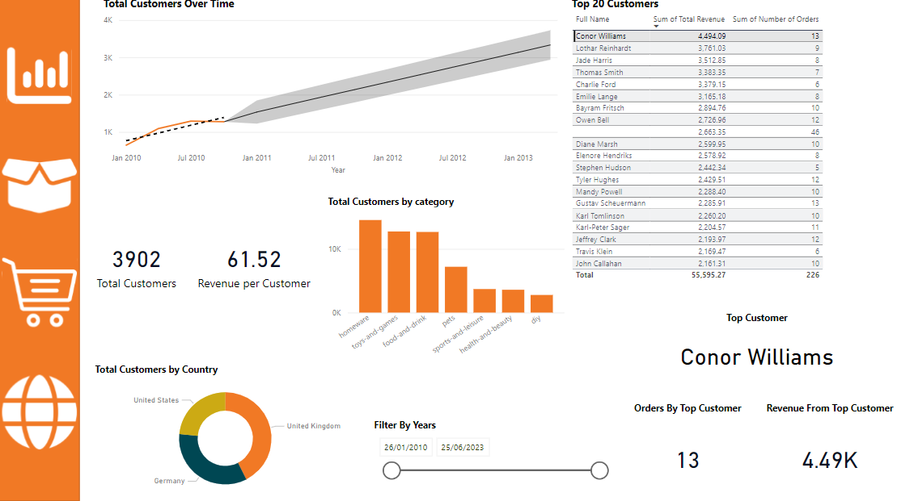
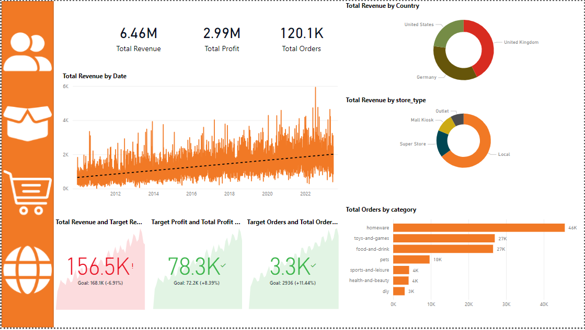
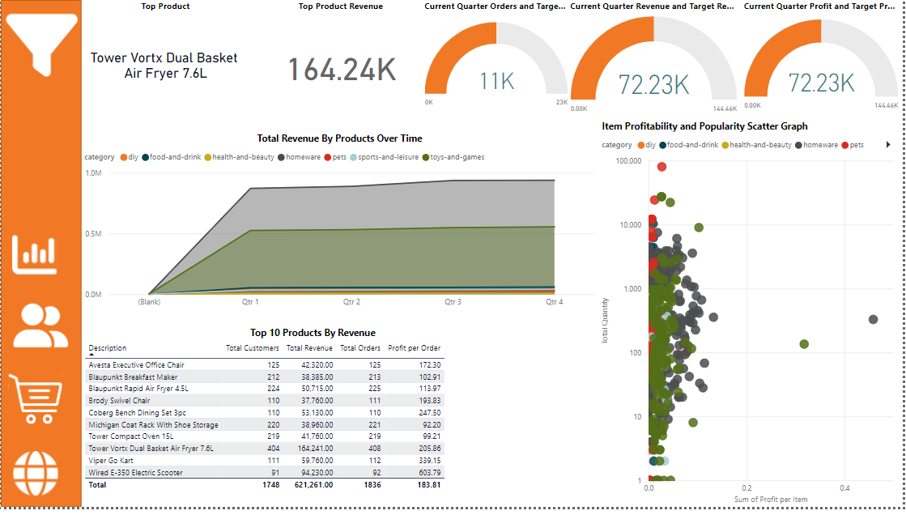
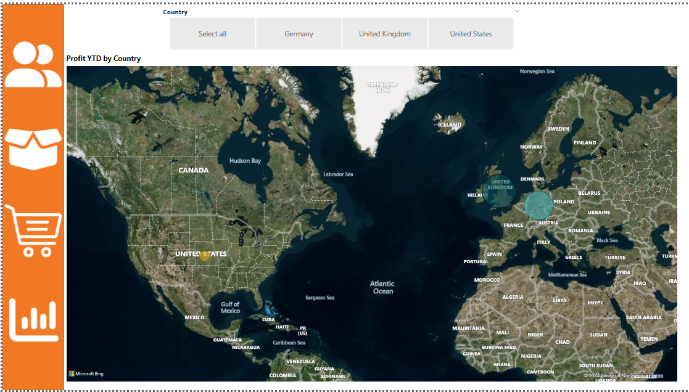

# Data Analytics Power BI Report

## Project Overview

This project involves the creation of a comprehensive Quarterly report for a medium-sized international retailer. With operations spanning across different regions, the goal is to elevate their business intelligence practices by transforming accumulated sales data into actionable insights. The report will be designed using Microsoft Power BI and will cover high-level business summaries, insights into highest value customers by sales region, detailed analysis of top-performing products against sales targets, and visually appealing maps showcasing performance metrics of retail outlets across different territories.

## Milestone 2 Achievements

### 1. Data Import and Transformation

#### Orders Table

- Connected to Azure SQL Database and imported the "orders_powerbi" table.
- Removed sensitive information by deleting the "Card Number" column.
- Split "Order Date" and "Shipping Date" into date and time components.
- Filtered out rows with missing or null values in the "Order Date" column.
- Renamed columns for consistency.

#### Products Table

- Downloaded and imported the "Products.csv" file.
- Removed duplicates based on the "product_code" column.
- Created new columns for weight values and units.
- Standardized units by replacing blank entries with "kg."
- Converted values column to a decimal number, handling conversion errors.
- Created a calculated column to convert non-"kg" units to kilograms.

#### Stores Table

- Connected to Azure Blob Storage and imported the "Stores" table.
- Renamed columns for consistency.

#### Customers Table

- Downloaded and imported the "Customers" folder using the Folder data connector.
- Combined and transformed the data, creating a "Full Name" column.
- Deleted unnecessary columns and renamed remaining columns.

## Milestone 3 Achievements:

### Date Table:

- Created a continuous date table covering the entire time period of the data.
- Added columns for Day of Week, Month Number, Month Name, Quarter, Year, Start of Year, Start of Quarter, Start of Month, Start of Week.

### Star Schema and Relationships:

- Created relationships between tables (Orders, Products, Stores, Customers, Date) to form a star schema.
- Set up the necessary one-to-many relationships with the correct filter directions.

### Measures Table:

A measures table was then generated to store key measures, these included:

- Total Orders
- Total Revenue
- Total Profit
- Total Customers
- Total Quantity
- Profit YTD
- Revenue YTD

These were generated using DAX formulas, some of which can be seen below:

- Total Orders = COUNT(Orders[Order Date])
- Total Revenue = SUMX(Orders, Orders[Product Quantity] * RELATED(Products[Sale Price]))
- Profit YTD = CALCULATE( [Total Profit], DATESYTD(Dates[Date]) )

 After this, the following DAX expression was used to create the Country column in the Stores table:

Country = SWITCH ( [Country Code], "GB", "United Kingdom", "US", "United States", "DE", "Germany", BLANK() )

Following this a Geography column was created to represent both the country and region in the country together using the following DAX formula:

Geography = Stores[Country Region] & ", " & Stores[Country]

Finally a Geography hierarchy was created with Region (continent) coming first, followed by Country, followed by the Country Region.

## Milestone 4: Report Pages and Navigation

In Milestone 4, we established the foundation for our report, creating four dedicated pages for specific insights and implementing a navigation system. Each page serves a unique purpose:

1. **Executive Summary**
   - High-level business overview for C-suite executives.
   
2. **Customer Detail**
   - In-depth customer-related analytics and visualizations.
   
3. **Product Detail**
   - Comprehensive analysis of product-related data.
   
4. **Stores Map**
   - Visual representation of store performance across territories.

## Milestone 5: Visual Design and Analysis

In Milestone 5, we focused on creating visually appealing reports with effective analysis. 

Key achievements include:

- **Color Theme Selection**: Implemented a cohesive color theme for consistency.
  
- **Card Visuals and Charts**: Utilized various visualizations for conveying essential information.

- **Hierarchies**: Established date and geography hierarchies for drill-downs and filtering.

To create these cards the following measures were created:

Customer with Most Revenue = TOPN(1, VALUES('Customers'[Full Name]), [Total Revenue], DESC)

Number of Orders by Top Customer = CALCULATE( COUNTROWS('Orders'), TOPN(1, VALUES('Customers'[User UUID]), [Total Revenue], DESC) )

Total Revenue by Top Customer = CALCULATE( [Total Revenue], TOPN(1, VALUES('Customers'[User UUID]), [Total Revenue], DESC) )

Finally a date slicer was added to allow users to filter the page by year, using the between slicer style.

The following image shows the customer detail page at this point:

## Milestone 6: Key Performance Indicators (KPIs)

Milestone 6 focused on implementing Key Performance Indicators for tracking quarterly targets. Achievements include:

- **KPI Creation**: Developed KPIs for Quarterly Revenue, Orders, and Profit.

- **Trend Analysis**: Incorporated trend analysis with forecasting.

- **Visual Placement**: Positioned KPIs strategically on the report pages.

The following image shows the executive summary page at this point:

## Milestone 7: Enhanced Visualizations and Interactivity

In Milestone 7, the focus was on enhancing visualizations and interactivity, ensuring a user-friendly experience. Key achievements include:

### Task 1: Enhanced Gauges

- Added three gauges showcasing current-quarter performance of Orders, Revenue, and Profit against quarterly targets.
- Implemented conditional formatting for the callout values for better visualization.
- Created measures for quarterly targets and growth percentages.

### Task 2: Executive Summary Page

- Incorporated various visuals, including cards, line graphs, donut charts, and a bar chart, providing a comprehensive overview.
- Added a date slicer to allow users to filter the page by year.

### Task 3: Duplicate Visuals on Executive Summary Page

- Copied and duplicated card visuals to the Executive Summary page for Total Revenue, Total Orders, and Total Profit.
- Adjusted formatting for decimal places in the Format > Callout Value pane.

### Task 4: Line Graph Configuration

- Copied and modified the line graph from the Customer Detail page.
- Set X-axis to the Date Hierarchy with specific levels displayed.
- Configured Y-axis to Total Revenue.
- Positioned the line chart below the cards on the Executive Summary page.

### Task 5: Donut Charts for Revenue Breakdown

- Added two donut charts showing Total Revenue breakdown by Store[Country] and Store[Store Type].
- Positioned the donut charts along the top of the page.

### Task 6: Bar Chart for Number of Orders

- Created a bar chart showing the number of orders by product category.
- Utilized the Total Customers by Product Category donut chart from the Customer Detail page as a starting point.

### Task 7: Key Performance Indicators (KPIs)

- Developed KPIs for Quarterly Revenue, Orders, and Profit.
- Configured Trend Analysis, Direction, Bad Color, Transparency, and Callout Value formatting.
- Duplicated and arranged KPI cards on the Executive Summary page.

To create the current quarter measures, the following DAX formula was used for the example of revenue:

Current Quarter Revenue = TOTALQTD(SUMX(Orders, Orders[Product Quantity] * RELATED(Products[Sale Price])), Dates[Date])

Following this, the previous quarter measures were calculated which can be seen below for the previous quarter revenue:

Previous Quarter Revenue = VAR CurrentQuarterStart = MAX(Dates[Start of Quarter]) VAR 
PreviousQuarterStart = EDATE(CurrentQuarterStart, -3) VAR 
PreviousQuarterEnd = EDATE(CurrentQuarterStart, -1) RETURN CALCULATE([Total Revenue], Dates[Start of Quarter] = PreviousQuarterStart)

Finally to create the target, for the example of revenue, the following DAX formula was used:

Revenue Quarterly Target = 'Measures Table'[Previous Quarter Revenue] * 1.1

This was repeated for profit and total orders to create the gauges.
Following this, an areas chart with the x-axis set as Dates[Start of Quarter], the y-axis values set as Total Revenue and the Legend as Products[Category] was created.

Following this, a table was created displaying the top 10 product descriptions by revenue (where data bars were added), showing their total orders, profit per order and total customers.

Two cards were added to highlight the top product, one card gives the product description, the other its revenue. To get these values the following DAX expressions were used:

Top Product = TOPN( 1, VALUES(Products[Description]), [Total Revenue], DESC )

Total Revenue by Top Product = CALCULATE( [Total Revenue], TOPN(1, VALUES(Products[Description]), [Total Revenue], DESC) )

After this a scatter graph was added to compare item profitaility with the total quantity ordered.

The first step was adding a profit per item column to the products table using the following formula:

Profit Per Item = Products[Sale Price] - Products[Cost Price]

The next step involved setting the values as the product descriptions, the x-axis as the profit per item, the y-axis as the total orders and the legend as product category.

The following image shows the product detail page at this point:

## Milestone 8: Geographic Analysis and Drillthrough Page

In Milestone 8, the focus shifted towards geographical analysis and creating a drillthrough page for store-specific insights.

### Task 1: Geographic Analysis

- Added a map visual on the Stores Map page, showcasing store performance metrics.
- Configured map controls, auto-zoom, and bubble size based on ProfitYTD.
- Implemented a slicer for filtering by Stores[Country].

### Task 2: Slicer Toolbar

- Created a slicer toolbar with custom icons for Products[Category] and Stores[Country].
- Utilized bookmarks for toggling between the open and closed state of the slicer toolbar.
- Added a back button for easy navigation.

### Task 3: Drillthrough Page

- Created a drillthrough page named Stores Drillthrough.
- Configured page type as Drillthrough with settings for triggering from Used as category and Drill through from to country region.
- Added visuals for top 5 products, total orders by product category, gauges for Profit YTD against targets, and a card for the selected store.

### Task 4: Custom Tooltip Page

- Implemented a custom tooltip page for the map visual, showing Profit YTD against targets.
- Copied and included the profit gauge visual on the tooltip page.
- Assigned the tooltip page to the map visual.

The following image shows the stores map page at this point:

## Documentation:

- Detailed steps for each task are provided in the conversation thread.
- DAX formulas for key measures and calculated columns are included in the Power BI file.

## Milestone 10 Achievements:
### Task 1: Database Exploration and Documentation

1. Printed a list of tables in the database and saved the result to a CSV file.

2. Printed a list of columns in the "orders" table and saved the result to a CSV file named "orders_columns.csv". Repeated this process for other tables in the database.

### Task 2: SQL Queries and Export to CSV

1. **Question 1:** How many staff are there in all of the UK stores?
   - SQL Query: See `question_1.sql`
   - Export Result: Saved to `question_1.csv`

2. **Question 2:** Which month in 2022 has had the highest revenue?
   - SQL Query: See `question_2.sql`
   - Export Result: Saved to `question_2.csv`

3. **Question 3:** Which German store type had the highest revenue for 2022?
   - SQL Query: See `question_3.sql`
   - Export Result: Saved to `question_3.csv`

4. **Question 4:** Created a view with store types, total sales, percentage of total sales, and count of orders.
   - SQL Query: See `question_4.sql`
   - Export Result: Saved to `question_4.csv`

5. **Question 5:** Which product category generated the most profit for the "Wiltshire, UK" region in 2021?
   - SQL Query: See `question_5.sql`
   - Export Result: Saved to `question_5.csv`

## Author

Saad Riahi Bejoud

## Conclusion

This project aims to provide actionable insights for better decision-making by transforming accumulated sales data into a comprehensive Quarterly report using Microsoft Power BI. The achieved milestones cover data import, transformation, and updating the Power BI file with the latest enhancements.